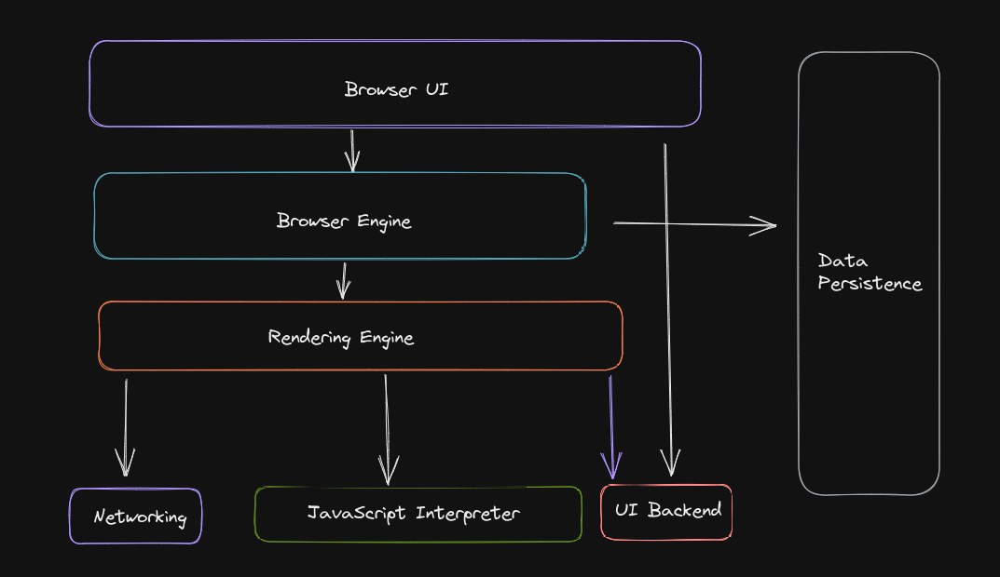

# Functionalities of a browser

---

### What is the main functionality of the browser?

A browser takes us anywhere on the internet. It is an application software that helps us retrieve and access information and resources from the world wide web.

The main function of a browser is to fetch and retrieve resources from the server over the internet. These browsers also provide a proper interface and displays content for the user.

When a browser fetches data from the internet connected server, it uses a piece of software called a rendering engine to translate the data into text and images. This data is written in Hyper Text Markup Language ( HTML ) and web browsers read this code to create what we see, hear and experience on the internet.

---

### High Level components of a browser.

The browser’s main components are :

1. The **user interface :** this can be the address bar, bookmarks menu, back/forward button, etc. It is basically every part of the browser display except the window where we see the requested page.
2. **Browser Engine** : assembles and arranges the actions between the UI and the rendering engine.
3. **The Rendering Engine :** is responsible for displaying the requested component. It will parse the requested HTML and CSS, and display the parsed content on the screen.
4. **Networking :** Network calls such as HTTP requests, using different implementations for different platform behind a headless interface.
5. **UI Backend** : It is used for generating combo boxes and windows, exposing a generic interface which is not platform specific. Underneath it uses the operating system’s user interface methods.
6. **Javascript Interpretor :** It is used to parse and execute Javascript code.
7. **Data Storage** : This is a persistence layer, the browser may need to store all sorts of data locally, such as cookies. Some of the storage mechanism that the browser supports can be localStorage, IndexedDB, WebSQL and FileSystem.

---

### Rendering Engine and its use.

A rendering engine is software that draws text and images on the screen. It draws structured text from a document (often HTML), and formats it properly based on the given style declarations (often CSS).

It can display other types of data with the help of a plug in, for examply displaying a pdf document with the help of a pdf viewer.

Examples :

- Blink
- Gecko
- EdgeHTML
- WebKit.

The rendering engine will start getting the contents of the requested documents from the networking layer. this will usually be done in 8kb chunks.

- starts parsing the HTML document and convert element to DOM nodes in a tree called the “content tree”. The engine will parse the style data, both in external CSS and in style elements. Styling information together with visual instructions HTML will  be used to create another tree: the render tree.
- After the construction of the render tree it goes through a “layout” process. This means giving each node the exact coordinates where it should appear on the screen. The next stage is painting. The render tree will be traversed and each node will be painted using the UI backend layer.

---

### Parsers (HTML, CSS, etc)

**HTML Parser :**

The job of the HTML parser is to parse the HTML markup into a parse tree.

- HTML has a “soft” syntax meaning it is more forgiving and sometimes let’s us omit start and end tags, and so on.
- This makes life easy for the web author but difficult to write a formal grammer, since it is not context free.

### CSS Parser :

WebKit uses Flex and Bison parser generators to create parsers automatically from the CSS grammer files.

- Bison creates bottom up shift-reducer parser.
- Firefox uses a top down parser written manually.

In both cases each CSS file is parsed into a stylesheet object. Each object contains CSS rules. The CSS rule object contain selector and declaration objects and other objects corresponding to CSS grammar.

---

### Script Processors.

The model of the web is synchronous. Author expects scripts to be parsed and executed immediately when the parser reaches the `<script>` tag. The parsing of the document is halted until the script has been executed.

---

### Tree Construction

While the DOM tree is being constructed the browser constructs another tree, the render tree.

- Firefox calls the elements in the render tree “frames”.
- A renderer knows how to lay out and paint itself as children.

---

### Order of script processing:

The following is the order of script processing : 

1. Scripts
2. Speculative Parsing
3. Style sheets

### Scripts:

The model of the web is synchronous. Authors expect scripts to be parsed and executed immediately when the parser reaches a `<script>`
 tag. The parsing of the document halts until the script has been executed. If the script is external then the resource must first be fetched from the network - this is also done synchronously, and parsing halts until the resource is fetched.

**Speculative parsing :**

Both WebKit and Firefox do this optimization. While executing scripts, another thread parses the rest of the document and finds out what other resources need to be loaded from the network and loads them. In this way, resources can be loaded on parallel connections and overall speed is improved. Note: the speculative parser only parses references to external resources like external scripts, style sheets and images: it doesn't modify the DOM tree - that is left to the main parser.

**Style sheets :**

Style sheets on the other hand have a different model. Conceptually it seems that since style sheets don't change the DOM tree, there is no reason to wait for them and stop the document parsing.

---

### Layout and Painting.

Layout is a recursive process. It begins at the root renderer, which corresponds to the `<html>` element of the HTML document. Layout continues recursively through some or all of the frame hierarchy, computing geometric information for each renderer that requires it.

The position of the root renderer is 0,0 and its dimensions are the viewport - the visible part of the browser window.

All renderers have a "layout" or "reflow" method, each renderer invokes the layout method of its children that need layout.

### **Painting :**

In the painting stage, the render tree is traversed and the renderer's "paint()" method is called to display content on the screen. Painting uses the UI infrastructure component.

### The painting order [#](https://web.dev/howbrowserswork/#the-painting-order)

[CSS2 defines the order of the painting process](http://www.w3.org/TR/CSS21/zindex.html). This is actually the order in which the elements are stacked in the [stacking contexts](https://web.dev/howbrowserswork/#stackingcontext). This order affects painting since the stacks are painted from back to front. The stacking order of a block renderer is:

1. background color
2. background image
3. border
4. children
5. outline

### Firefox display list

Firefox goes over the render tree and builds a display list for the painted rectangular. It contains the renderers relevant for the rectangular, in the right painting order (backgrounds of the renderers, then borders etc).

That way the tree needs to be traversed only once for a repaint instead of several times - painting all backgrounds, then all images, then all borders etc.

Firefox optimizes the process by not adding elements that will be hidden, like elements completely beneath other opaque elements.

### WebKit rectangle storage [#](https://web.dev/howbrowserswork/#webkit-rectangle-storage)

Before repainting, WebKit saves the old rectangle as a bitmap. It then paints only the delta between the new and old rectangles.