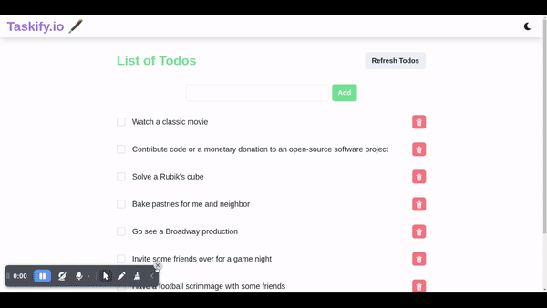

# Taskify.io

Taskify.io is a Todo application that allows you to add, delete, and mark tasks as completed. It utilizes the `useReducer` hook to manage the application state and provides error handling for adding blank todos, notifying the user through toast notifications.




## Installation

To run the project locally, please follow these steps:

1. Clone the repository:

   ```bash
   git clone https://github.com/your-username/taskify.io.git
   ```

2. Navigate to the project directory:

   ```bash
   cd taskify.io
   ```

3. Install dependencies:

   ```bash
   npm install
   ```

## Usage

1. Start the development server:

   ```bash
   npm start
   ```

2. Open your web browser and visit `http://localhost:3000` to access the Taskify.io application.

## Features

- Add a Todo: Enter a task description in the input field and click the "Add" button to add it to your task list. An error toast notification will be shown if the input is blank.
- Delete a Todo: Click the "Delete" button next to a task to remove it from the task list.
- Mark Todo as Completed: Click the checkbox next to a task to mark it as completed. The task will be visually indicated as completed.

## Technologies Used

- React: JavaScript library for building user interfaces.
- Chakra UI: Component library for React applications.
- Axios: Promise-based HTTP client for making API requests.

## Contributing

If you'd like to contribute to Taskify.io, please follow these steps:

1. Fork the repository on GitHub.
2. Create a new branch from the `main` branch.
3. Make your desired changes and commit them.
4. Push your branch to your forked repository.
5. Open a pull request on the main repository.

## License

This project is licensed under the [MIT License](LICENSE).

## Contact

If you have any questions or suggestions, feel free to reach out to us on [GitHub](https://github.com/Varu98).

Thank you for using Taskify.io! We hope it helps you stay organized and productive.